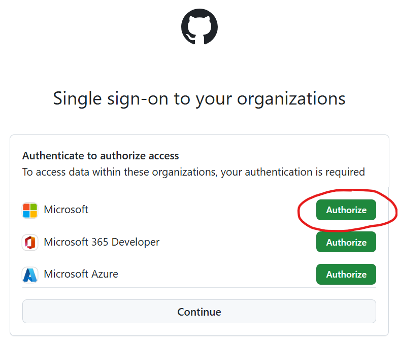

# AI Toolkit FAQ

### There are too many fine-tune settings do I need to worry about all of them?

No, you can just run with the default settings and our current dataset in the project to test. If you want you can also pick your own dataset but you will need to tweak some setting see [this](walkthrough-hf-dataset.md) tutorial for more info.

### AI Toolkit Preview would not scaffold the fine-tuning project

Make sure to check for the prerequisites before installing the extension. More details at [Prerequisites](README.md#prerequisites).

### I have the NVIDIA GPU device but the prerequisites check fails

If you have the NVIDIA GPU device but the prerequisites check fails with "GPU is not detected", make sure that the latest driver is installed. You can check and download the driver at [NVIDIA site](https://www.nvidia.com/Download/index.aspx?lang=en-us).
Also, make sure that it is installed in the path. To check, run run nvidia-smi from the command line.

### I generated the project but Conda activate fails to find the environment

There might have been an issue setting the environment you can manually initialize the environment using `bash /mnt/[PROJECT_PATH]/setup/first_time_setup.sh` from inside the workspace.

### When using a Hugging Face dataset how do I get it?

Make sure before you start the `python finetuning/invoke_olive.py` command you run `huggingface-cli login` this will ensure the dataset can be downloaded on your behalf.

### Can I use my own models or other models from Hugging Face?

Not at this time but we are working to expand the list of models.

### Does the extension work in Linux or other systems?

At this time we only support running the extension in Windows and Linux but we are currently planning for other platform support. The extension uses WSL but will not run within the environment.

### Can I use the extension on an Azure VM?

At this time Azure GPU VMs do not support nested virtualization which is needed to run the WSL environment this will prevent the extension from working.

### How can I disable the Conda auto activation from my WSL

To disable the conda install in WSL you can run `conda config --set auto_activate_base false` this will disable the base environment.

### Do you support containers today?

We are currently working on the container support and it will be enable in a future release. We currently use WSL as the location to run the pipeline and we install the pre-requisites there for you. 

### Why do you need GitHub and Hugging Face credentials?

We host all the project templates in GitHub and the base models are hosted in Azure or Hugging Face which requires accounts to get access to them from the APIs.

### I am getting an error downloading Llama2

Please ensure you request access to Llama through this form [Llama 2 sign up page](https://github.com/llama2-onnx/signup) this is needed to comply with Meta's trade compliance.

### Can't save project inside WSL instance
Because the remote sessions are currently not supported when running the AI Toolkit Actions, you cannot save your project while being connected to WSL. To close remote connections, click on "WSL" at the bottom left of the screen and choose "Close Remote Connections".

### Error: GitHub API forbidden

We host the project templates in GitHub repositry *microsoft/windows-ai-studio-templates*, and the extension will call GitHub API to load the repo content. If you are in Microsoft, you may need to authorize Microsoft organization to avoid such forbidden issue.

See [this issue](https://github.com/microsoft/vscode-ai-toolkit/issues/70#issuecomment-2126089884) for workaround. The detailed steps are:
- Sign out GitHub account from VS Code
- Reload VS Code and AI Toolkit and you will be asked to sign in GitHub again
- [Important] In browser's authorize page, make sure to authorize the app to access "Microsoft" org
  