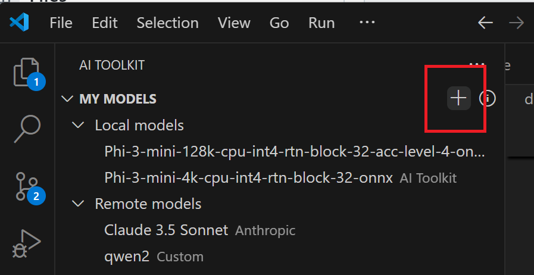
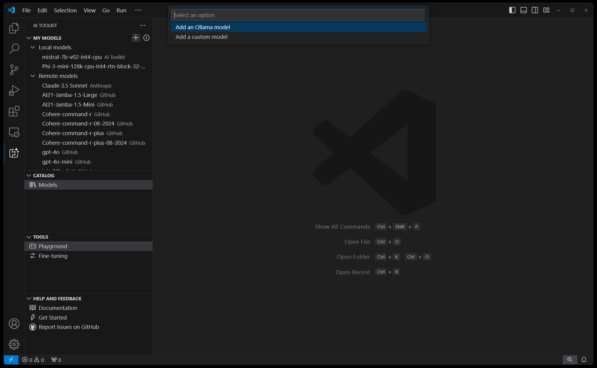
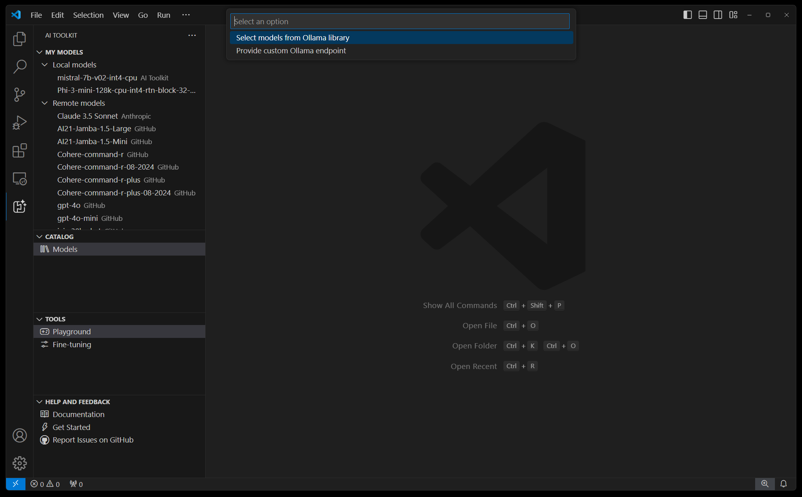
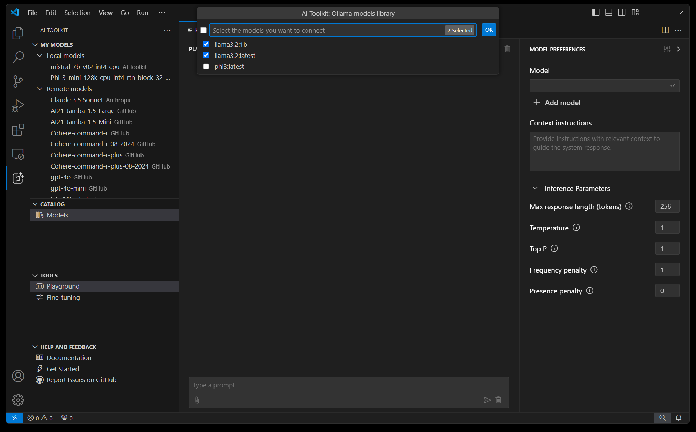

# Models in AI Toolkit

## Models supported

AI Toolkit support a boradrange of generative AI models. Both Small Language Models (SLM) and Large Language Models (LLM) are supported.

## Find a model

On AI Toolkit, click the "Models" on treeview to open the model catalog, as shown in step 1. 

There are a set of filters on model catalog as shown in step2:
- Hosted by:
    
    AI Toolkit now supports GitHub, ONNX, OpenAI, Anthropic, Google as model hosting sources.
- Publisher:
    
    The publisher for AI models. e.g. Microsoft, Meta, Google, OpenAI, Anthropic, Mistral AI, etc.

- Task:

    Now only 'text generation' is for this filter.

- Device Type:

    Depends on the local availability, to filter models by CPU, GPU and NPU.

Additional filters to filter modes that can run locally or remotely, with default to include all model types.

Fine-tuning Support switch filters only the model that can be used to run finetuning.

## License and sign-in

Some of the models require publisher or hosting service license and account to sign-in.

## Find model details

Click on each model card in model catalog to find more details on the model.

## Select a model for test

On each model card, there are several options: 
- **Try in Playground** link that can load selected model in playground for test without model downloading.
- **Download** link that will download the model to local first from source like Hugging Face.
- **Load in Playground** will load the downloaded model into playground for chat.

## Bring Your Own Models

AI Toolkit's playground supports remote models. Mouse-over "MY MODELS" on treeview, a "+" sign appears to add a remote model into AI Toolkit. Fill in the requested information on model name, display name, model hosting URL and optional auth string. A remote model is added and shown in treeview as step3.

## Ollama models

### Prerequisites

- AI Toolkit v0.6.2 or newer.
- [Ollama](https://ollama.com/download) (Tested on Ollama v0.4.1)

### Steps to add local Ollama into AI Toolkit

1. Click the "+" button while hovering on treeview **MY MODELS** or click the **+ Add model** button in model catalog or playground.

1. Select **Add an Ollama model**

    

1. Select **Select models from Ollama library**. Or if you start Ollama runtime at a different address, you can choose "Provide custom Ollama endpoint" to specify Ollama endpoint.

    

1. Select the models you want to add to AI Toolkit.

    

    > Please note that it will only show models that are already downloaded in Ollama and not already added to AI Toolkit. In order to download a model from Ollama you can run `ollama pull <model-name>`. You can see the list of models supported by Ollama in [Ollama library](https://ollama.com/library) or refer to [Ollama documentation](https://github.com/ollama/ollama).

1. You will see it on treeview's **MY MODELS** list. Use it the same way as other models in playground.

    > Attachment is not support yet for Ollama models. Since we connect to Ollama using its [OpenAI compatible endpoint](https://github.com/ollama/ollama/blob/main/docs/openai.md) and it doesn't support attachments yet.
